# data-engineering-toolkit

**Purpose of the project**

This project is designed to strengthen my understanding and practical skills in using Git and GitHub. It covers:

1. Repository creation and setup.

2. Branching strategy for organized development.

3. Feature branch development for building ETL process scripts.

4. Pull requests and merge requests to integrate changes into the main branch.

Through this project, I aim to gain a deeper grasp of the workflow, logic, and best practices involved in Git and GitHub collaboration.

**Documentation**

***Repository Creation***

The first step carried out was the craetion of a repository named "data-engineering-toolkit" ensuring the README.md file is turned on.

The https link was copied out and then used to clone the repository on my local machine. A .gitignore file was created in the main folder which was used to hide all virtual environment and .pyc files to avoid public viewing of secrets. 

**Branching Strategy**

The git flow branching stategy was adopted by creating different branches for each task/new feature.
In my README.md, documentation was written to make the first commit to the remote repo. 
New branches (Develop and feature/branch-name) were created and on my github, I ensured branch protection rules were created on main branch to require pull request before merging.

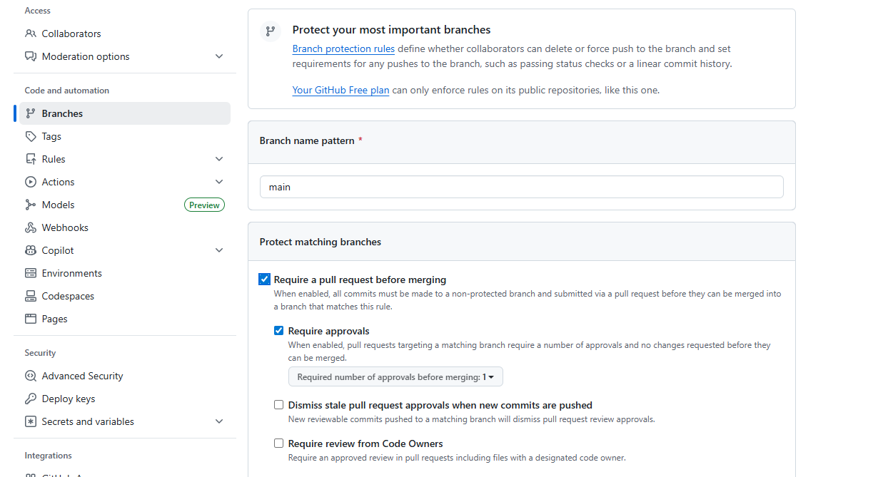

The first wriiten documentation was added and pushed to Develop branch, it created a pull request on the remote repo, and changes was checked befored being merged to the main branch.

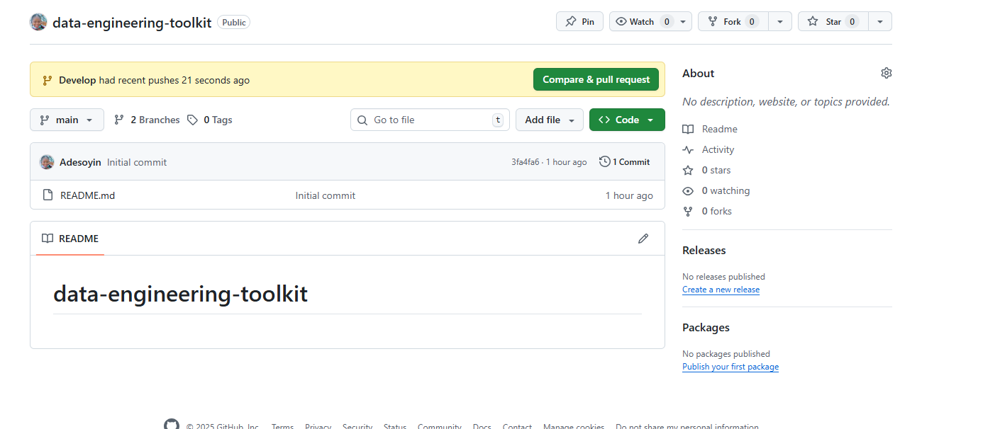

Decription of the changes added and comments applied.

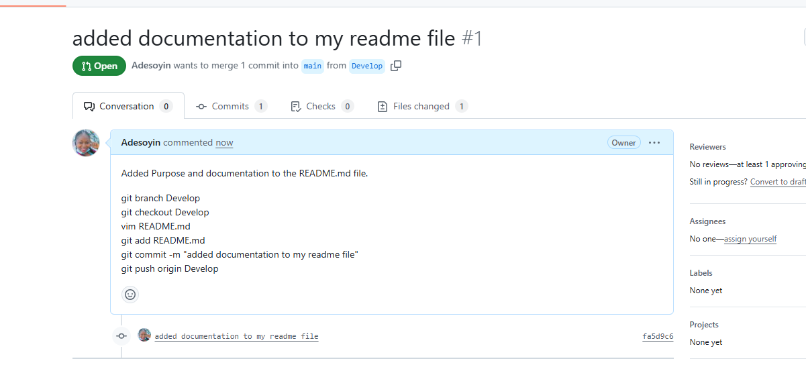

**Data Cleaning Branch (feature/datacleaning branch)**

The new feature where the data ingestion and cleaning was created and a new file called datacleaning.py was created to write the cleaning script. 

The file was added to staging, commited and pushed to the remote repo feature/datacleaning branch.

    git branch feature/datacleaning

    git checkout feature/datacleaning

    touch datacleaning.py

    git add datacleaning.py

**Data Transformation Branch (feature/datatransform branch)**

The new feature branch where the data transformation is being carried out was also created and a new file called datatransform.py was created to write the transformation script. 

The file was added to staging, commited and pushed to the remote repo feature/datatransform branch as well.

    git branch feature/datatransform

    git checkout feature/datatransform

    touch datatransform.py

    git add datatransform.py

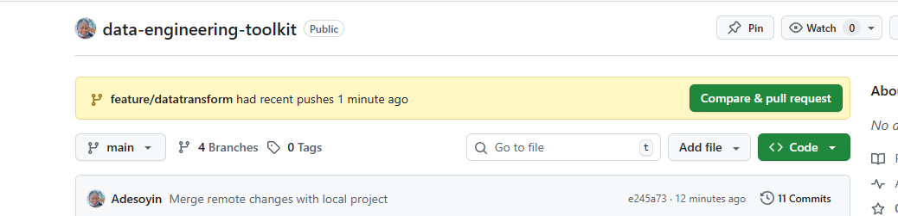

*Pull request and merging to Develop branch*

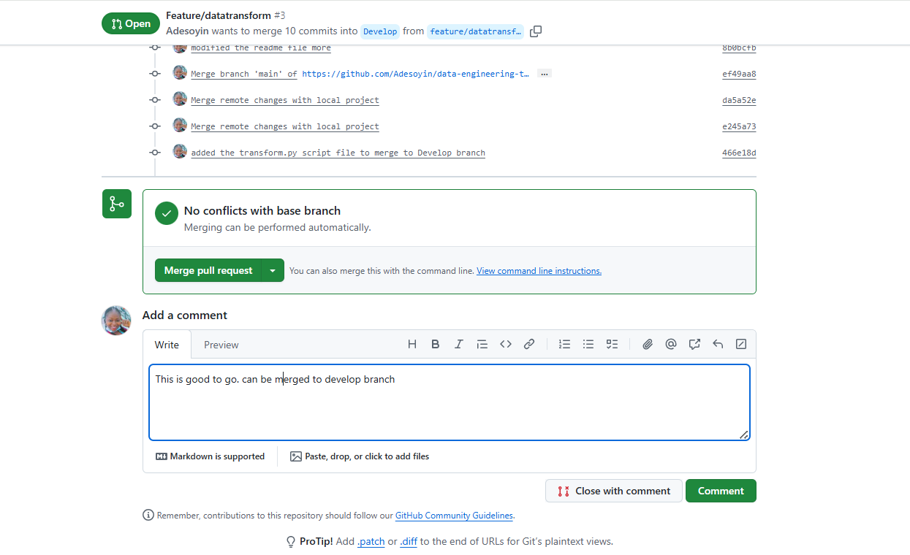

*Develop branch with update to be moved to main branch*

*Compare and pull request to the main branch from Develop branch.*

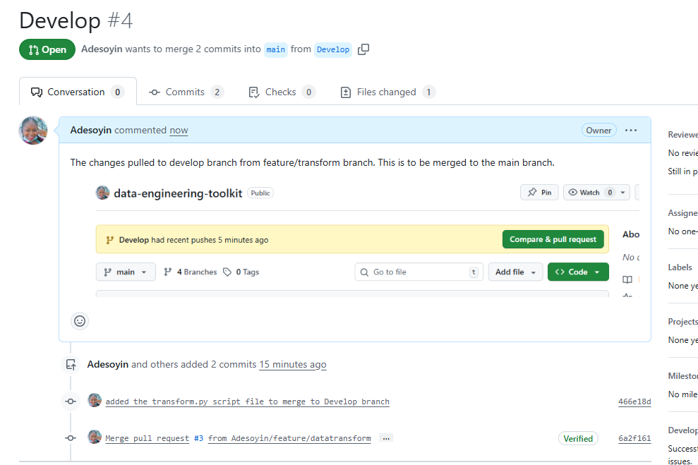

**Data Loading Branch (feature/dataload branch)**

A new feature was created to host the .py file that loads the transformed data into its destination. The added file was added to staging, commited and pushed to the remote repo feature/dataloadbranch.

    git branch feature/dataload

    git checkout feature/dataload

    touch dataload.py

    git add dataload.py

    git commit -m "added the load.py script file to merge to Develop branch"

    git push origin feature/dataload

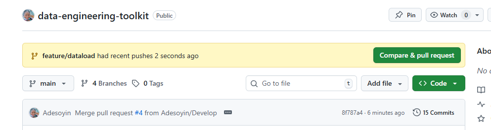

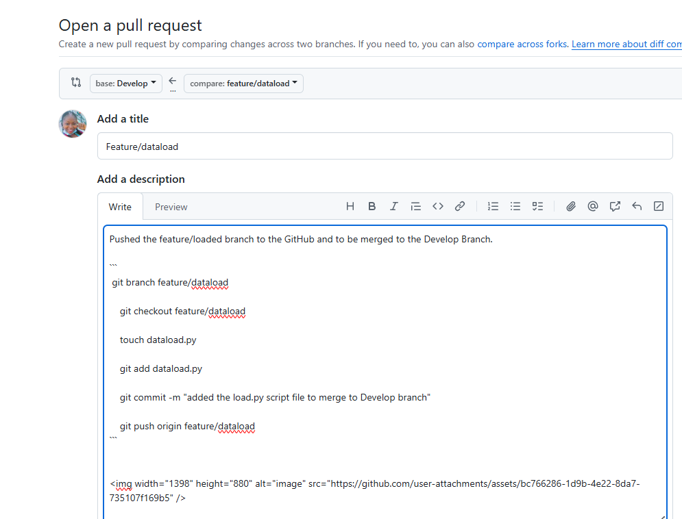

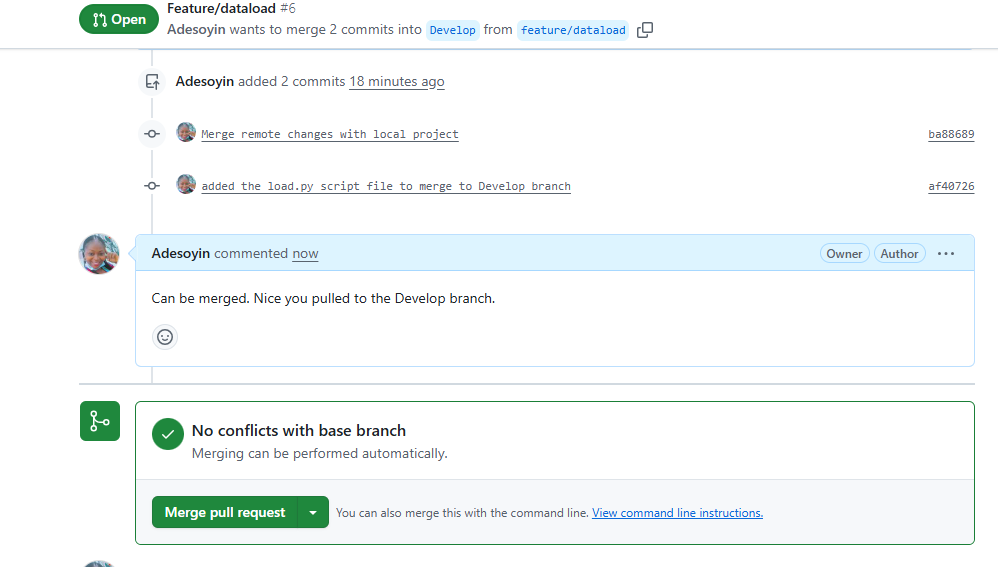

 **Pull Request and Code Review Process**

For each push request from the feature branch to the remote repo, a pull request was created and reviews done in the remote repo, a description and code images attached before being merged into the Develop branch.
Periodically, I merged the develop branch into main branch.

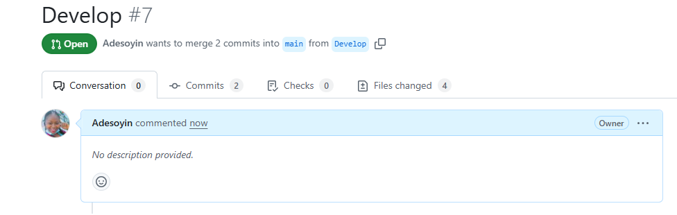

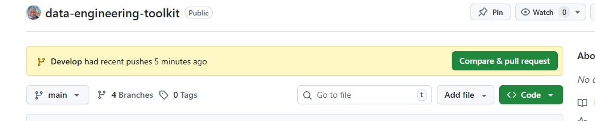

**git Code written**

To create virtual environment

    python -m venv venv

To activate the environment

    source venv/Scripts/activate

To see status of the repo

    git status

To create a new branch called "Develop" -which serves as a branch for all integration.

    git branch Develop

    git checkout Develop   -m "moved to the new branch created"

*Information:*

**ETL Feature Branches**

I created a Feature branch for new features/script addition.
Each feature branch files was pushed to the Develop branch intermittently as new chnages are being made, reviewed, with comments and a pull request to the main branch.
The Develop branch was then priodically merged to the main branch.

**Conclusion**

In conclusion, this exercise had deepen my knowledge on the git and github integration with git codes uses. 
It has helped me to know how to create branch, push changes made in the local repo to to guthub, cretae pull request to feature branches and then merge the branches to the main branch. It has also helped me to understand the benefits of not merging directlt to the main branch to avoid conflicts and the benefit of review with other developers.

This is truly superb!

**Shout Out**
I wouldn't believe I would do this. All thanks to Tutor Aviator for his teachings and patience.
    

