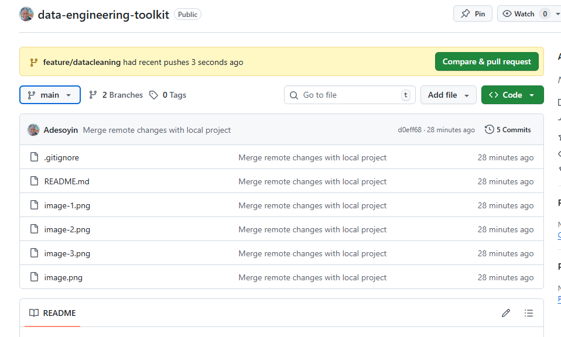
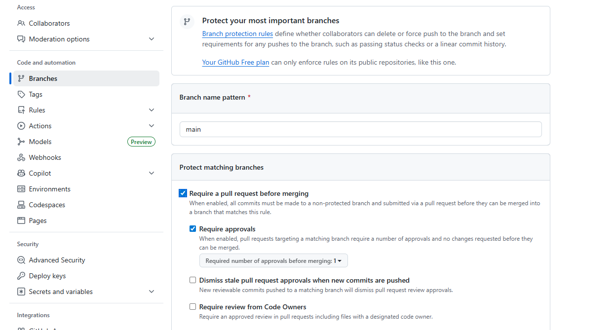
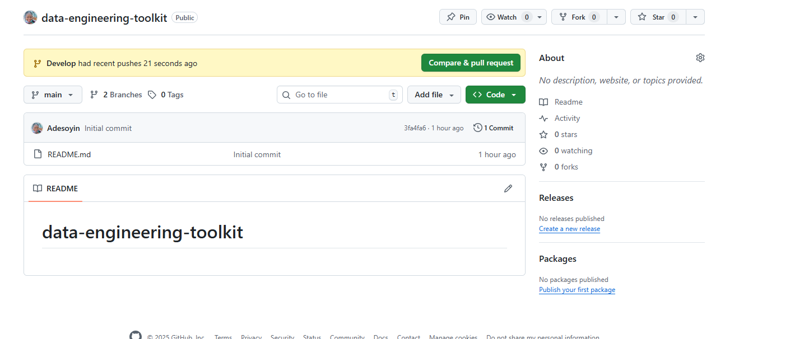
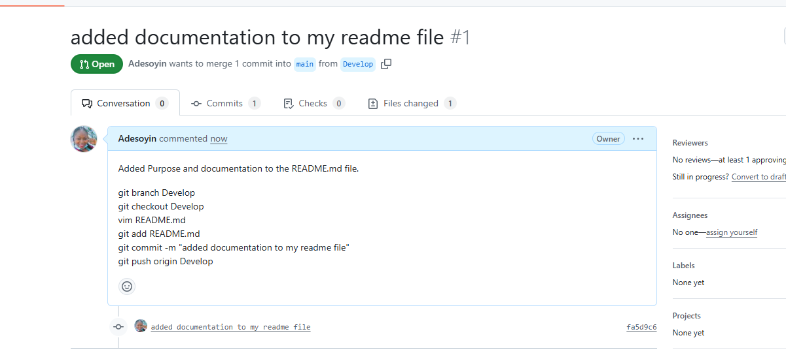
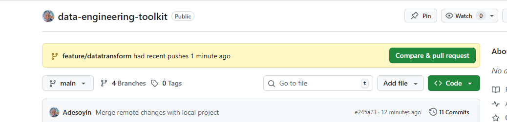
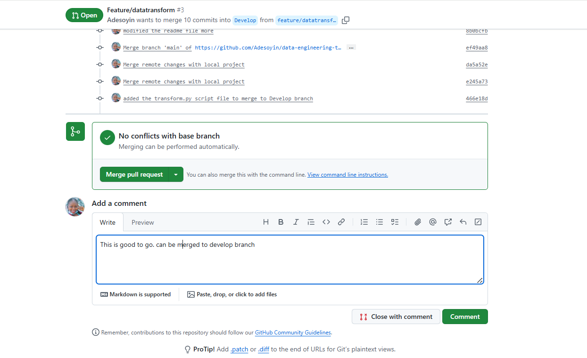

# data-engineering-toolkit

*Purpose of the project*

This project aim to understand and practice the fundamental of repository creation, branch strategy, development of script on feature branch to run ETL processes, request pull and merge request on remote repository. 
This will further heighten my understanding and logic flow of the whole processes of git and github. 

**Documentation**

*Repository Creation*

The first step carried out was the craetion of a repository named "data-engineering-toolkit" ensuring the README.md file is turned on.

The https link was copied out and then used to clone the repository on my local machine. A .gitignore file was created in the main folder which was used to hide all virtual environment and .pyc files to avoid public viewing of secrets. 

**Branching Strategy**

The git flow branching stategy was adopted by creating different branches for each task/new feature.
In my README.md, documentation was written to make the first commit to the remote repo. 
New branches (Develop and feature/branch-name) were created and on my github, I ensured branch protection rules were created on main branch to require pull request before merging.

The first wriiten documentation was added and pushed to Develop branch, it craeted a pull request on the remote repo, and changes was checked befored being merged to the main branch

**Data Cleaning Branch (feature/datacleaning branch)**

The new feature where the data ingestion and cleaning was created and a new file called datacleaning.py was created to write the cleaning script. 

The file was added to staging, commited and pushed to the remote repo feature/datacleaning branch

**Data Transformation Branch (feature/datatransform branch)**

The new feature branch where the data transformation is being carried out was also created and a new file called datatransform.py was created to write the transformation script. 

The file was added to staging, commited and pushed to the remote repo feature/datatransform branch as well.

    git branch feature/datatransform

    git checkout feature/datatransform

    touch datatransform.py

    git add datatransform.py

**Pull request and merging to Develop branch**

**Data Loading Branch (feature/dataload branch)**

A new feature was created to host the .py file that loads the transformed data into its destination. The added file was added to staging, commited and pushed to the remote repo feature/dataloadbranch.

 **Pull Request and Code Review Process**

For each push request from the feature branch to the remote repo, a pull request was created and reviews done in the remote repo, a description and code images attached before being merged into the Develop branch.

**git Code written**

To create virtual environment

    python -m venv venv

To activate the environment

    source venv/Scripts/activate

To see status of the repo

    git status

To create a new branch called "Develop" -which serves as a branch for all integration.

    git branch Develop

    git checkout Develop   -m "moved to the new branch craeted"

*Information:*

**ETL Feature Branches**

I created a Feature branch for new features/script addition. The first branch created "feature/datacleaning"

    git branch feature/datacleaning

    git checkout feature/datacleaning

    touch datacleaning.py

    git add datacleaning.py

